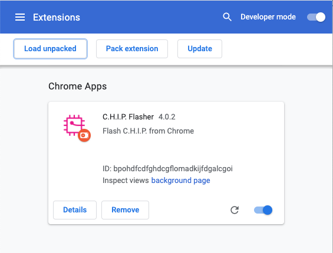
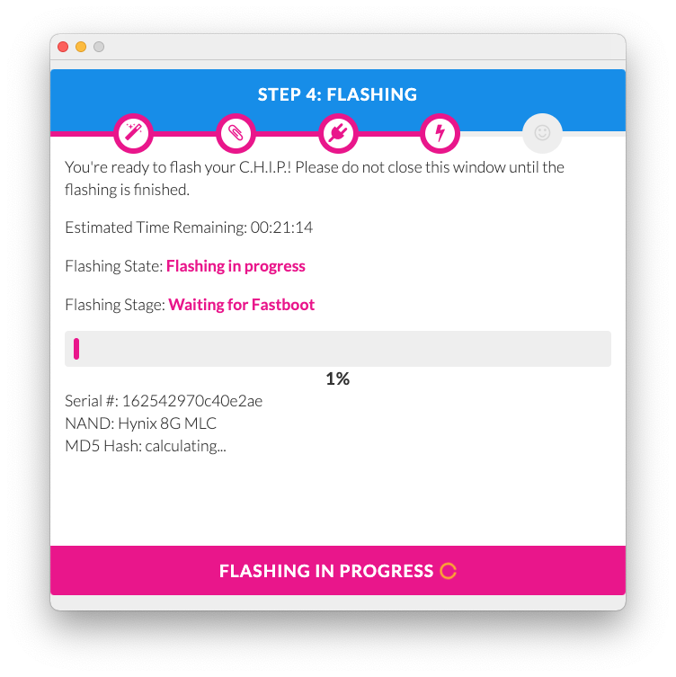
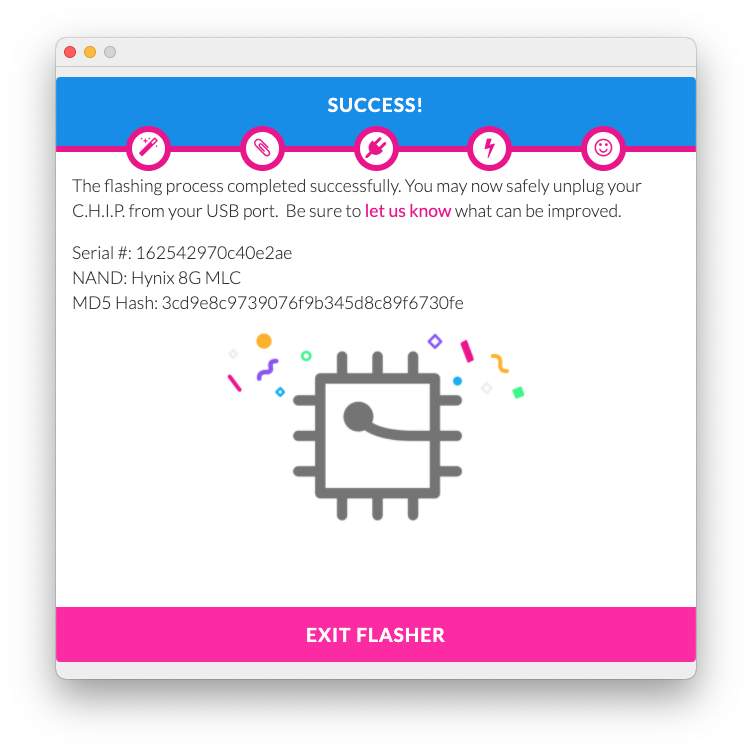

## CHIP Flash extension 

This is the original CHIP Flash extension that can be used to flash `.chp` images to your CHIP offline.

To use this extension, you'll need to load the "C.H.I.P. Flasher extension" directory as an _Unpacked extension_ in Chrome (or Chromium).

### 1. Navigate to `chrome://extensions/`
### 2. Enable "Developer mode" at the top right
### 3. Click "Load unpakced" at the top left
### 4. Browse to your "C.H.I.P. Flasher extension" directory and open it

Once the extension is installed, you will find it in the _Apps_ launcher in Chrome `chrome://apps/`.

Click the "CHIP Flasher" icon and follow the instructions.

You can download `.chp` images from here: [http://chip.jfpossibilities.com/flash-chrome/](http://chip.jfpossibilities.com/flash-chrome/)