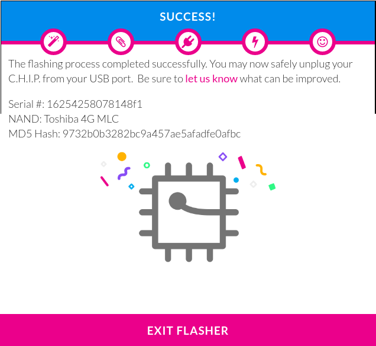

# CHIP-flasher-chromeplugin

Getting custom software onto hardware is hard. Particularly if you want people to be able to modify, change, and share that software. It can be as easy visiting a web page, connecting our devices, and loading our customized versions.

[flash.getchip.com](http://flash.getchip.com) uses the [C.H.I.P. Flasher chrome-plugin](https://chrome.google.com/webstore/detail/chip-flasher/bpohdfcdfghdcgflomadkij)

Most AllWinner [boot roms](http://linux-sunxi.org/BROM) detect when a uboot pin is connected to ground. This forces the devices into [FEL mode](http://linux-sunxi.org/FEL) to support flashing. On the [C.H.I.P.](https://getchip.com/pages/chip), a physical paperclip is used to short the uboot/FEL pin.

NextThingCo doesn't seem to publish the source to this, but I think it would be
useful to have a readable and modifiable version.
